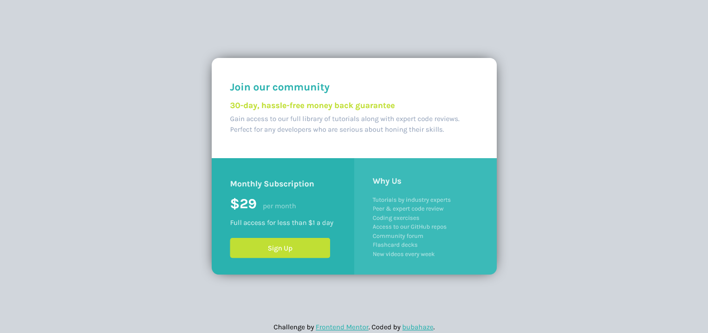

# Frontend Mentor - Single price grid component solution

This is a solution to the [Single price grid component challenge on Frontend Mentor](https://www.frontendmentor.io/challenges/single-price-grid-component-5ce41129d0ff452fec5abbbc). Frontend Mentor challenges help you improve your coding skills by building realistic projects. 

## Table of contents

- [Overview](#overview)
  - [The challenge](#the-challenge)
  - [Screenshot](#screenshot)
- [My process](#my-process)
  - [Built with](#built-with)
  - [What I learned](#what-i-learned)
  - [Continued development](#continued-development)
  - [Useful resources](#useful-resources)
- [Author](#author)

## Overview

### The challenge

Users should be able to:

- View the optimal layout for the component depending on their device's screen size
- See a hover state on desktop for the Sign Up call-to-action

### Screenshot

## My process

### Built with

- HTML5
- Sass/CSS
- CSS Grid
- Desktop-first workflow
- Visual Studio Code

### What I learned

CSS Grid and better understanding of media queries, although still it's a long journey 😎.

### Continued development

In my plans is some more fun fun fun with Grid and responsive design.

### Useful resources

- [MMC School](https://www.mmcschool.pl) - I am grateful for a wonderful YT tutorial on CSS Grid, in my opinion better than other Grid tutorials on YouTube in English 🏆

## Author

- Github - [bubahaze](https://www.github.com/bubahaze)
- Frontend Mentor - [@bubahaze](https://www.frontendmentor.io/profile/bubahaze)
